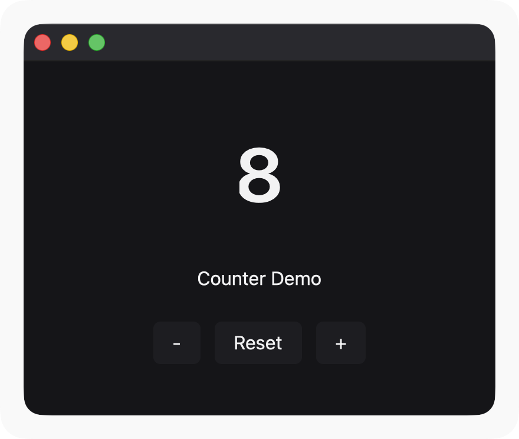
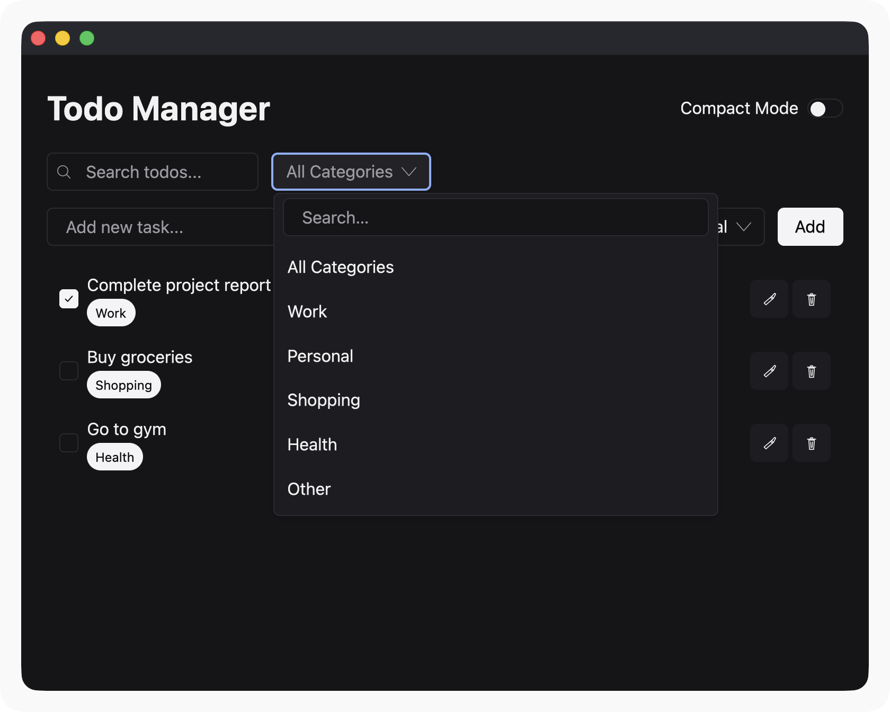
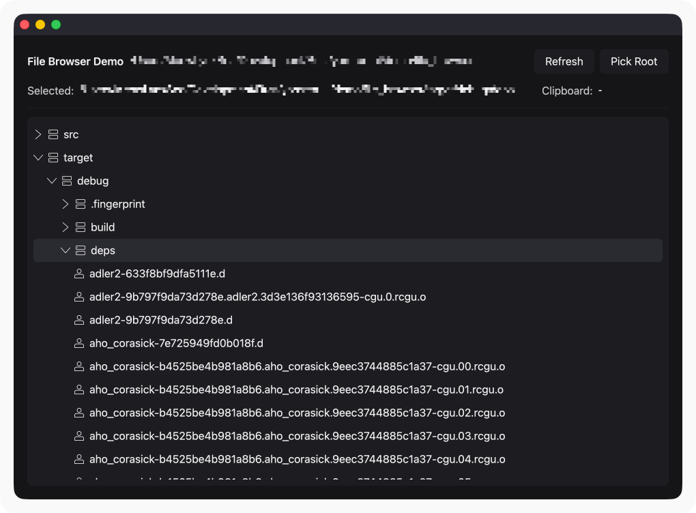
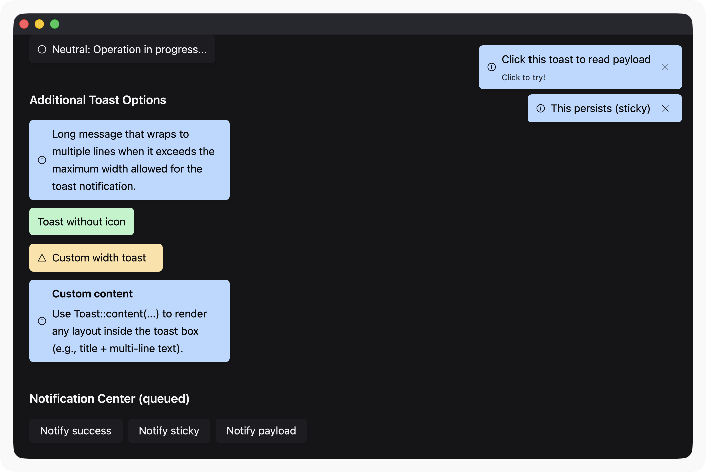
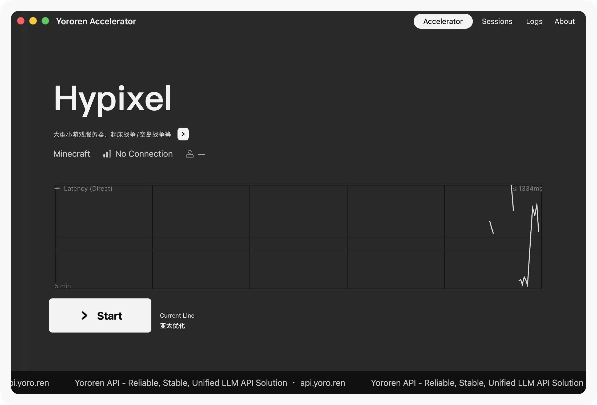
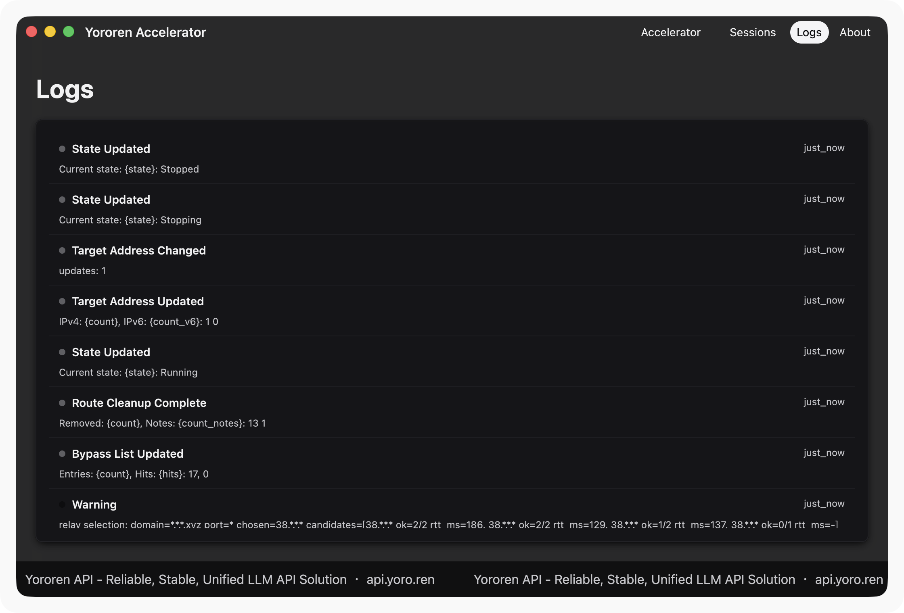
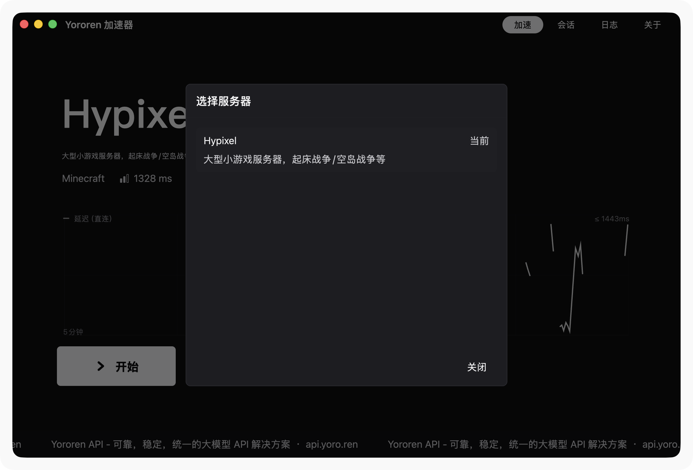
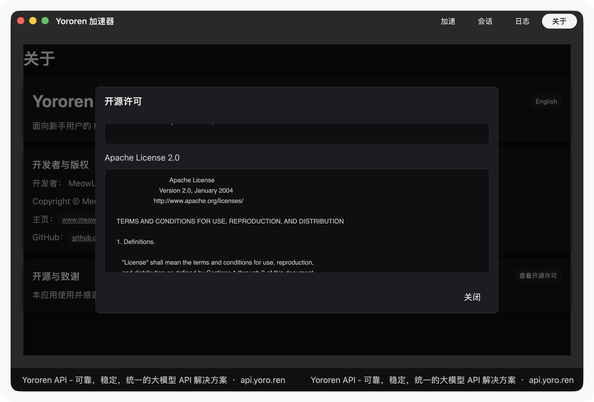

# Yororen UI

<p align="center">
  <strong>中文版</strong> | <a href="README.md">English</a>
</p>

<p align="center">
  
  
  
</p>

<p align="center">
  <strong>Yororen UI</strong> 是一个基于 <a href="https://github.com/zed-industries/zed"><code>gpui</code></a>（Zed）构建的可复用 UI 组件和小部件库。
</p>

<p align="center">
  它旨在被 <code>gpui</code> 应用程序 crate 使用，同时保持 UI 层的独立性（主题、组件、小部件和嵌入式图标资源）。
</p>

---

## 特性

<table>
  <tr>
    <td><strong>60+ 组件</strong></td>
    <td>按钮、输入框、徽章、工具提示、图标、标题、卡片、模态框、树形控件等</td>
  </tr>
  <tr>
    <td><strong>小部件</strong></td>
    <td>TitleBar、VirtualList 等高级小部件</td>
  </tr>
  <tr>
    <td><strong>主题系统</strong></td>
    <td><code>GlobalTheme</code> + <code>ActiveTheme</code> 辅助工具，支持浅色/深色模式</td>
  </tr>
  <tr>
    <td><strong>动画系统</strong></td>
    <td>可配置的动画，包含预设、缓动函数和编排器</td>
  </tr>
  <tr>
    <td><strong>国际化</strong></td>
    <td>多语言支持（英文、中文），文本方向支持（LTR/RTL）</td>
  </tr>
  <tr>
    <td><strong>无障碍</strong></td>
    <td>ARIA 支持、焦点管理、键盘导航、焦点陷阱</td>
  </tr>
  <tr>
    <td><strong>嵌入式资源</strong></td>
    <td>29+ 个 SVG 图标，通过 <code>rust-embed</code> 嵌入（<code>assets/icons/**</code>）</td>
  </tr>
  <tr>
    <td><strong>通知系统</strong></td>
    <td>Toast 通知，包含多种样式、队列管理和交互操作</td>
  </tr>
</table>

---

## 快速开始

### 1) 注册组件

某些组件需要一次性注册/初始化。在应用程序启动时调用 <code>component::init</code>：

```rust
use gpui::App;
use yororen_ui::component;

fn init_ui(cx: &mut App) {
    component::init(cx);
}
```

### 2) 安装全局主题

Yororen UI 提供了一个 <code>GlobalTheme</code>，可根据 <code>WindowAppearance</code> 自动选择浅色/深色配色方案。

```rust
use gpui::App;
use yororen_ui::theme::GlobalTheme;

fn init_theme(cx: &mut App) {
    cx.set_global(GlobalTheme::new(cx.window_appearance()));
}
```

在渲染函数中，您可以通过 <code>ActiveTheme</code> 访问主题颜色：

```rust
use gpui::{Render, div};
use yororen_ui::theme::ActiveTheme;

// 在 render(..., cx: &mut gpui::Context<Self>) 中
let theme = cx.theme();
let _ = div().bg(theme.surface.base).text_color(theme.content.primary);
```

### 3) 提供资源（图标）

此 crate 将其图标嵌入到 <code>assets/icons/**</code> 下，并作为 <code>gpui::AssetSource</code>（<code>yororen_ui::assets::UiAsset</code>）公开。

如果您的应用程序只需要 Yororen UI 的图标，可以直接安装：

```rust
use gpui::Application;
use yororen_ui::assets::UiAsset;

let app = Application::new().with_assets(UiAsset);
```

如果您的应用程序也有自己的资源，可以组合资源源以同时使用两组资源。Yororen UI 提供了一个小助手 <code>CompositeAssetSource</code>：

```rust
use gpui::Application;
use yororen_ui::assets::{CompositeAssetSource, UiAsset};

// `MyAsset` 是您自己的 AssetSource 实现
let app = Application::new().with_assets(CompositeAssetSource::new(MyAsset, UiAsset));
```

<strong>重要：</strong> 您的主要 <code>AssetSource</code> 在路径不存在时应返回 <code>Ok(None)</code>。如果它在缺失路径时返回错误，可能会阻止回退到 <code>UiAsset</code>。

---

## 示例应用程序

我们提供四个官方示例应用程序，帮助您快速入门：

| 示例 | 描述 | 运行命令 |
|------|------|----------|
| <a href="#counter">计数器</a> | 极简计数器应用 - 适合学习基础概念 | <code>cd demo/counter && cargo run</code> |
| <a href="#todolist">待办事项</a> | 待办事项应用模板 - 构建完整应用的理想选择 | <code>cd demo/todolist && cargo run</code> |
| <a href="#file-browser">文件浏览器</a> | 带树形结构的文件浏览器 | <code>cd demo/file_browser && cargo run</code> |
| <a href="#toast-notification">通知演示</a> | Toast 通知展示 | <code>cd demo/toast_notification && cargo run</code> |

### 计数器

<p align="center">
  
</p>

一个极简的计数器应用程序，展示了 Yororen UI 最基本的概念。

<strong>核心功能：</strong>
- 简单的全局状态管理（<code>Arc&lt;Mutex&lt;T&gt;&gt;</code>）
- 按钮点击事件处理（<code>on_click</code>）
- 响应式 UI 更新（<code>cx.notify()</code>）

<strong>适用场景：</strong> Yororen UI 初学者的第一个学习示例。

### 待办事项

<p align="center">
  
</p>

一个待办事项应用程序模板，展示了构建完整 Yororen UI 应用程序的标准模式和最佳实践。

<strong>核心功能：</strong>
- 应用程序启动模式
- 模块化架构（状态、组件、模型）
- 全局状态管理
- CRUD 操作（创建、读取、更新、删除待办事项）

<strong>适用场景：</strong> 开发生产级应用程序，作为启动模板使用。

### 文件浏览器

<p align="center">
  
</p>

一个功能完整的文件浏览器示例，展示了如何渲染和交互复杂层次数据结构。

<strong>核心功能：</strong>
- <strong>目录树</strong>（<code>Tree</code> + <code>TreeItem</code>）：显示文件系统层次结构
- <strong>图标</strong>：文件和文件夹图标显示
- <strong>空状态</strong>：无内容时显示友好提示
- <strong>上下文菜单</strong>：右键菜单支持复制/粘贴操作

<strong>适用场景：</strong> 需要树形结构、文件管理器或任何层次数据显示的场景。

### 通知演示

<p align="center">
  
</p>

展示了 Toast 通知组件的各种样式和使用模式。

<strong>核心功能：</strong>
- 多种 Toast 类型：成功、警告、错误、信息、中性
- 通知队列管理（<code>NotificationCenter</code>）
- 交互式通知（带操作按钮）
- 自定义通知内容
- 不同的关闭策略（自动关闭/手动）

<strong>适用场景：</strong> 需要向用户提供即时反馈的应用程序。

---

## 基于 Yororen UI 构建

使用 Yororen UI 构建的项目和应用程序。

### Yororen Accelerator

<p align="center">
  
  
</p>
<p align="center">
  
  
</p>

一个网络加速工具，具备本机透明 TCP 导流 + relay 透传功能，使用 Yororen UI 构建。

**核心亮点：**
- 复杂的数据仪表板，实时统计显示
- 自定义窗口边框，接近原生体验
- 丰富的数据表格和虚拟化列表
- 服务器管理和配置界面

---

## 包含内容

### 模块

<table>
  <tr>
    <td><code>yororen_ui::theme</code></td>
    <td>
      <ul>
        <li><code>Theme</code>（配色方案）</li>
        <li><code>GlobalTheme</code>（<code>gpui::Global</code>）</li>
        <li><code>ActiveTheme</code> trait（在 <code>App</code> 和渲染上下文中提供 <code>theme()</code>）</li>
      </ul>
    </td>
  </tr>
  <tr>
    <td><code>yororen_ui::assets</code></td>
    <td>
      <ul>
        <li><code>UiAsset</code>（嵌入图标的 <code>gpui::AssetSource</code>）</li>
        <li><code>CompositeAssetSource</code>（组合两个资源源并支持回退）</li>
      </ul>
    </td>
  </tr>
  <tr>
    <td><code>yororen_ui::component</code></td>
    <td>
      <ul>
        <li>常用构建块：<code>button</code>、<code>icon_button</code>、<code>text_input</code>、<code>password_input</code>、<code>tooltip</code>、<code>badge</code>、<code>divider</code> 等</li>
        <li><code>component::init(cx)</code> 用于任何注册</li>
      </ul>
    </td>
  </tr>
  <tr>
    <td><code>yororen_ui::widget</code></td>
    <td>由组件组合的高级小部件。目前包括：<code>TitleBar</code> 和 <code>VirtualList</code>。</td>
  </tr>
  <tr>
    <td><code>yororen_ui::animation</code></td>
    <td>
      <ul>
        <li>缓动函数（线性、二次、三次、带回弹、弹性、弹跳）</li>
        <li>预设动画（淡入淡出、滑动、缩放、弹跳）</li>
        <li>动画编排（序列、并行、交错）</li>
      </ul>
    </td>
  </tr>
  <tr>
    <td><code>yororen_ui::a11y</code></td>
    <td>
      <ul>
        <li>ARIA 角色和属性定义</li>
        <li>焦点管理（FocusTrap）</li>
        <li>无障碍辅助工具</li>
      </ul>
    </td>
  </tr>
  <tr>
    <td><code>yororen_ui::i18n</code></td>
    <td>
      <ul>
        <li>多语言支持</li>
        <li>语言环境管理和运行时切换</li>
        <li>数字和日期格式化</li>
      </ul>
    </td>
  </tr>
  <tr>
    <td><code>yororen_ui::notification</code></td>
    <td>
      <ul>
        <li><code>Toast</code> 组件</li>
        <li><code>NotificationCenter</code> 用于队列管理</li>
      </ul>
    </td>
  </tr>
</table>

### 组件概览

<table>
  <tr>
    <td><strong>基础</strong></td>
    <td>Button, IconButton, Icon, Label, Text, Heading, Spacer, Divider, Card, FocusRing</td>
  </tr>
  <tr>
    <td><strong>输入</strong></td>
    <td>TextInput, PasswordInput, NumberInput, TextArea, SearchInput, FilePathInput, KeybindingInput</td>
  </tr>
  <tr>
    <td><strong>选择</strong></td>
    <td>Checkbox, Radio, RadioGroup, Switch, Slider, Select, ComboBox</td>
  </tr>
  <tr>
    <td><strong>展示</strong></td>
    <td>Badge, Avatar, Image, Progress, Skeleton, Tag, Spinner</td>
  </tr>
  <tr>
    <td><strong>浮层</strong></td>
    <td>Tooltip, Popover, Modal, Toast, DropdownMenu</td>
  </tr>
  <tr>
    <td><strong>布局</strong></td>
    <td>Card, ListItem, EmptyState, Disclosure, ClickableSurface</td>
  </tr>
  <tr>
    <td><strong>交互</strong></td>
    <td>ToggleButton, SplitButton, DragHandle, ButtonGroup, ShortcutHint, KeybindingDisplay</td>
  </tr>
  <tr>
    <td><strong>树形/层级</strong></td>
    <td>Tree, TreeNode, TreeItem, TreeData, TreeDrag</td>
  </tr>
  <tr>
    <td><strong>表单</strong></td>
    <td>Form, ContextMenuTrigger</td>
  </tr>
  <tr>
    <td><strong>导航</strong></td>
    <td>TitleBar 小部件, VirtualList, VirtualRow</td>
  </tr>
</table>

### 图标

组件图标 API 使用强类型名称：

```rust
use yororen_ui::component::{icon, IconName};

let _ = icon(IconName::Minecraft);
```

图标路径映射到嵌入的 SVG 资源，如 <code>icons/minecraft.svg</code>。

---

## 环境要求

<ul>
  <li><strong>Rust edition：</strong> 2024（与您的 <code>gpui</code> 应用程序使用的工具链兼容）</li>
  <li><code>gpui</code> 是 git 依赖，需要固定到特定提交</li>
</ul>

---

## 安装

### 从 GitHub 使用（推荐）

通过 git 添加此 crate 作为依赖，并使用发布标签固定：

```toml
[dependencies]
yororen_ui = { git = "https://github.com/MeowLynxSea/yororen-ui.git", tag = "v0.1.0" }
```

### 从本地路径使用（开发时）

```toml
[dependencies]
yororen_ui = { path = "../yororen-ui" }
```

---

## 固定 <code>gpui</code>

<code>gpui</code> 更新频繁，且通过 git 依赖进行使用。如果您的应用程序和 <code>yororen_ui</code> 使用了<em>不同</em>的 <code>gpui</code> 版本，您将看到如下错误：

<blockquote>
  "multiple different versions of crate <code>gpui</code> in the dependency graph"
</blockquote>

以及许多 trait/类型不匹配的问题。

<strong>推荐方法：</strong>

<ul>
  <li>在您的应用程序工作区中，将 <code>gpui</code> 固定到相同的 <code>rev</code></li>
  <li>将 <code>yororen_ui</code> 和您的应用程序都固定到相同的 <code>gpui</code> 版本</li>
</ul>

在本仓库中，<code>gpui</code> 已在 <code>Cargo.toml</code> 中固定。

---

## 许可证

<ul>
  <li>Yororen UI 采用 <strong>Apache License, Version 2.0</strong> 授权。参见 <code>LICENSE</code>。</li>
  <li>本项目基于 <code>gpui</code>（Zed Industries）构建，同样采用 Apache-2.0 许可证。</li>
</ul>

归属详情请参见 <code>NOTICE</code>。

---

## 贡献

欢迎提交 Issue 和 PR。

修改视觉效果时：

<ul>
  <li>请提供截图或简短录制</li>
  <li>保持代码符合 <code>rustfmt</code> 规范</li>
</ul>

---

## Wiki

参见 <a href="https://github.com/MeowLynxSea/yororen-ui/wiki" target="_blank">Yororen UI Wiki</a> 获取详细文档、指南和组件参考。
